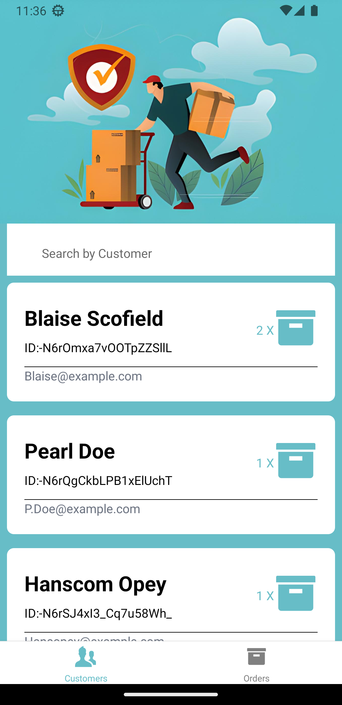

# UPS
# My React Native App

This mobile application is built with React Native and TypeScript. It uses libraries such as react-native-maps, Apollo Client, and Expo. The app features a login screen, a customer screen, and an orders screen, and it communicates with the backend via a GraphQL API managed by StepZen.

## Features

1. **Login Screen:** This is the initial screen where users can input their credentials to log in to the app.

2. **Customer Screen:** Upon successful login, users are directed to the customer screen where they can interact with various customer-related features.

3. **Orders Screen:** Users can manage their orders on the orders screen.

## Technologies

- [React Native](https://reactnative.dev/) and [TypeScript](https://www.typescriptlang.org/): The app is built using React Native for the user interface and TypeScript for static type checking.
- [react-native-maps](https://github.com/react-native-maps/react-native-maps): This library provides the map functionality in the app.
- [Apollo Client](https://www.apollographql.com/docs/react/): A comprehensive state management library for JavaScript that enables you to manage both local and remote data with GraphQL.
- [StepZen](https://stepzen.com/): A service for building, running, and deploying GraphQL APIs.
- [Expo](https://expo.io/): An open-source platform for making universal native apps for Android, iOS, and the web with JavaScript and React.

## Installation

First, clone the repository:

git clone https://github.com/0xNunana/UPS.git

Then, install the dependencies:
cd yourrepository
npm install

To start the Expo server, run:
expo start

## Images
    

